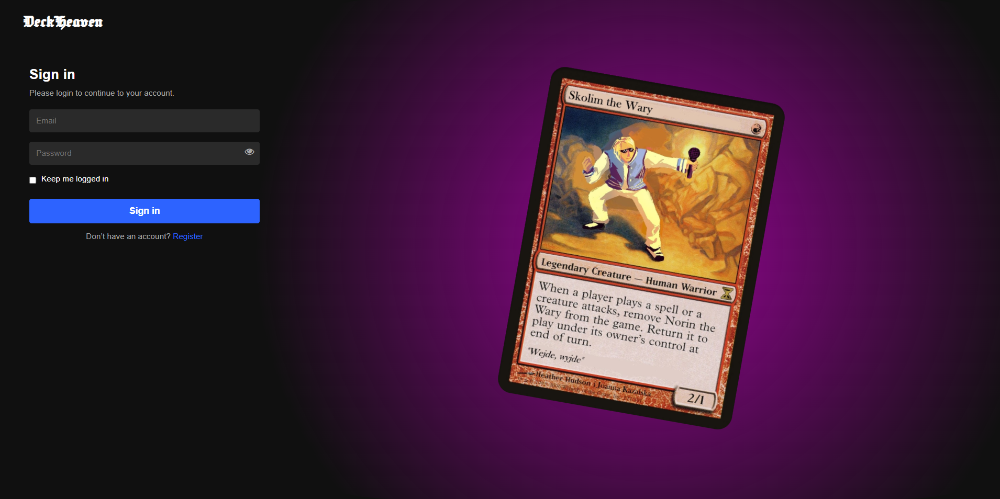
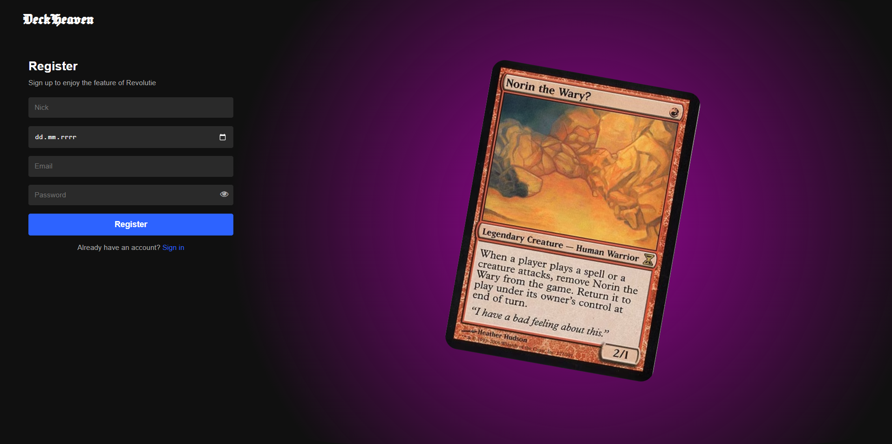
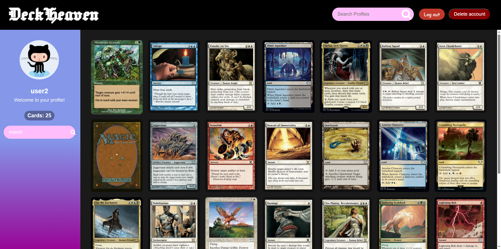
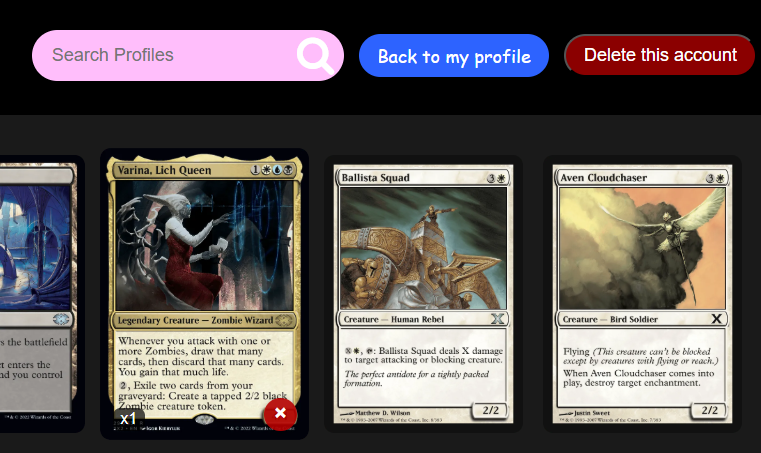
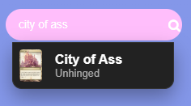
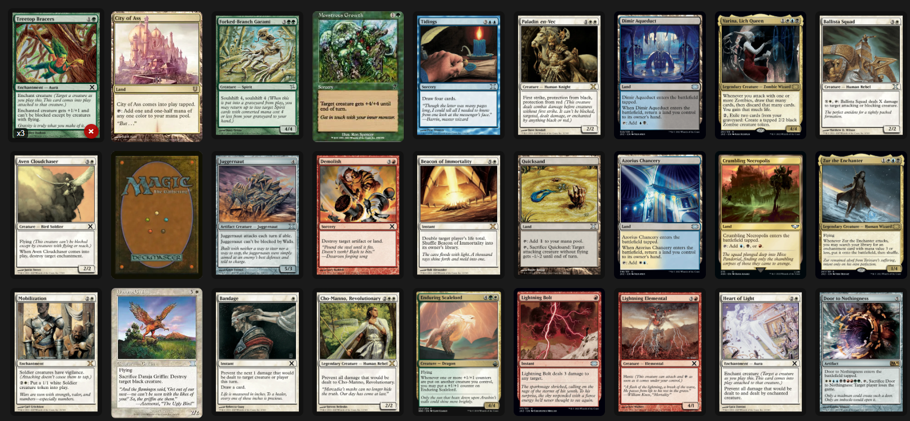
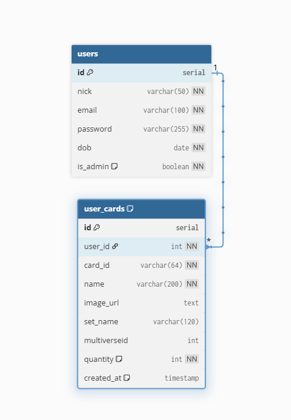

# DeckHeaven

A full‑stack web app for building and showcasing Magic: The Gathering card collections. The project is split into a React (Vite) frontend and a FastAPI backend with JWT authentication.

## Table of Contents
- [Screenshots / Demo](#screenshots--demo)
- [Features](#features)
- [Tech Stack](#tech-stack)
- [Project Structure](#project-structure)
- [Installation / Setup](#installation--setup)
- [API Documentation](#api-documentation)
- [Database](#database)
- [Authors](#authors)
- [License](#license)

## Screenshots / Demo
- Login page:


- Registration page:


- User dashboard/profile:


- Admin panel:


- Adding a card:


- Full collection view:



## Features
- [x] User registration and login (JWT)
- [x] View own and public profiles
- [x] Search Magic: The Gathering cards and add to collection
- [x] Quantity tracking and quick remove/decrement
- [x] Admin role: manage any user’s cards and delete accounts
- [x] Unified profile view with dynamic public/private/admin controls

## Tech Stack
- Frontend: React + Vite, SCSS, React Router
- Backend: FastAPI, SQLAlchemy, JWT
- Database: SQLite (dev) with ORM
- API docs: Swagger/OpenAPI (FastAPI)

## Project Structure
```
.
├─ backend/                # FastAPI backend (JWT, SQLAlchemy, SQLite)
├─ frontend/               # React + Vite frontend (SCSS)
├─ source/                 # Legacy PHP source (reference)
└─ screens/                # Screenshots for README
```

## Installation / Setup
### Backend
```powershell
cd backend
python -m venv .venv
.\.venv\Scripts\Activate.ps1
pip install -r requirements.txt
uvicorn main:app --reload
```
API: http://localhost:8000

### Frontend
```powershell
cd frontend
npm install
npm run dev
```
App: http://localhost:5173

### Environment
Create `frontend/.env`:
```
VITE_API_URL=http://localhost:8000
```

## API Documentation
- Swagger UI: http://localhost:8000/docs
- ReDoc: http://localhost:8000/redoc

## Database
- SQLite file: `backend/app.db`
- Tables are created on startup.
- Admin bootstrap: email `admin@gmail.com`, password `123`.

## Database Schema

- Users, user_cards, and a unique constraint on `(user_id, card_id)`.
- Admin user seeded and enforced idempotently by email.

Diagram ERD:




## Authors
- Ernest Leśniak

## License
Open source (academic use)
